# Scene recognition with bag of words

## Overview
The goal of this project is to learn basic image recognition methods. Our real objective is to write some codes implementing scene recognition, starting with **tiny-images and Kth-nearest neighbor** and then move on to the state of the art method : **bags of features + linear SVC**.


## Implementation
### 1. Feature Extraction<br/>
Before classifying images into scene categories, we need to do some pre-processing first. In this lab, we're going to use two methods to extract features from images, which is mentioned in the following blocks.<br/>

* **Tiny image** ([get_tiny_images.py](https://github.com/gary1346aa/homework3/blob/master/code/get_tiny_images.py))<br/>

Rather than extracting a complicated feature, Tiny-image just simply resizes the image into a 256 (16x16 flatten) data and get them normalized, a pure clean image feature will be collected with good performance.
<br/>
```python
    for i, image_data in enumerate(image_paths):
        
        image = Image.open(image_data)
        image_re = np.asarray(image.resize((16,16), Image.ANTIALIAS), dtype = 'float32').flatten()
        tiny_images[i,:] = (image_re - np.mean(image_re))/np.std(image_re)
```


* **Building vocabulary**([build_vocablary.py](https://github.com/gary1346aa/homework3/blob/master/code/build_vocabulary.py))<br/>

This is a given function, it extract SIFT by sampling the descriptors from the images, clustering with 
k-means algorithm and returning the cluster centers.<br/>  

```python
    bag_of_features = []
    print("Extract SIFT features")
    for path in image_paths:
        img = np.asarray(Image.open(path),dtype='float32')
        frames, descriptors = dsift(img, step=[5,5], fast=True)
        bag_of_features.append(descriptors)
    bag_of_features = np.concatenate(bag_of_features, axis=0).astype('float32')
    print("Compute vocab")
    start_time = time()
    vocab = kmeans(bag_of_features, vocab_size, initialization="PLUSPLUS")        
    end_time = time()
    print("It takes ", (start_time - end_time), " to compute vocab.")
```


* **Bag of SIFT**([get_bags_of_sifts.py](https://github.com/gary1346aa/homework3/blob/master/code/get_bags_of_sifts.py))<br/>

This function is based on the completed vocabulary pickles, we assign each local feature to its nearest cluster center and build a histogram indicating how many times each cluster was used, and then normalize the histogram in order to prevent the bag of SIFT features's from varying alot from the image size.<br/>

```python

    with open('vocab.pkl', 'rb') as v:
        vocab = pickle.load(v)
        image_feats = np.zeros((len(image_paths),len(vocab)))
        
    for i, path in enumerate(image_paths):
        
        image = np.asarray(Image.open(path), dtype = 'float32')
        frames, descriptors = dsift(image, step=[5,5], fast=True)
        
        dist = distance.cdist(vocab, descriptors, 'euclidean')
        mdist = np.argmin(dist, axis = 0)
        histo, bins = np.histogram(mdist, range(len(vocab)+1))
        if np.linalg.norm(histo) == 0:
            image_feats[i, :] = histo
        else:
            image_feats[i, :] = histo / np.linalg.norm(histo)
```

### 2. Classification<br/>
Now we have several feature extraction methods, so we can move on to the classification process which categorizes the testing images into the corresponding category according to the model trained by training images.

* **(Kth)-Nearest neighbor classifier**([nearest_neighbor_classify.py](https://github.com/gary1346aa/homework3/blob/master/code/nearest_neighbor_classify.py))<br/>

NN classfies the test image into the corresponding category where its feature is closest to the members in that category. If we modify the nearest neighbor's number, the accuracy will increase because only one neighbor will lead to a high sensitivity to outliers.<br/>

```python
    k = 7
    test_predicts = []
    dist = distance.cdist(train_image_feats, test_image_feats, 'euclidean')
    
    for i in range(dist.shape[1]):
        ans = np.argsort(dist[:,i])
        nn = dict()
        #print(ans)
        for j in range(k):
            if train_labels[ans[j]] in nn.keys():
                nn[train_labels[ans[j]]] += 1
            else :
                nn[train_labels[ans[j]]] = 1
 
        snn = sorted(nn.items(), key = operator.itemgetter(1), reverse=True)
        test_predicts.append(snn[0][0])
```


* **Linear SVM**([svm_classify.py](https://github.com/gary1346aa/homework3/blob/master/code/svm_classify.py))<br/>
We use the native scikit-learn package, importing multiclass Linear support power machine classifier. By using the native function `GridsearchCV()`, we can throw several parameters as input and the function will return the best performance parameters.<br/>

```python
    svc = LinearSVC(random_state=0)
    param_C = [0.001 , 0.01 , 0.1, 1.0, 10.0, 100.0, 1000.0, 10000.0]
    param_grid = [{'C': param_C}]

    gs = GridSearchCV(estimator = svc,
                      param_grid= param_grid,
                      scoring='accuracy',
                      verbose=0)
    
    gs = gs.fit(train_image_feats, train_labels)
    
    print(f'Best Training Score = {gs.best_score_:.3f} with parameters {gs.best_params_}')
    
    classifier = gs.best_estimator_
    classifier.fit(train_image_feats, train_labels)
    
    
    pred_label = classifier.predict(test_image_feats)

```

* **(Extra)Add a validation set to your training process to tune learning parameters.**<br/>
As mentioned at the SVC section, by using the native function `GridsearchCV()`, we can throw several parameters as input and the function will return the best performance parameters. <br/>
Ex : C = [0.001, 0.01, 0.1, 1, 10, 100, 1000]<br/>
Result : 
Getting paths and labels for all train and test data
Best Training Score = 0.651 with parameters {'C': 1.0}
Accuracy =  0.6766<br/>


* **(Extra)Gaussian SVM**<br/>
Instead of using LinearSVC, the SVC provided by the same package gives a better fitting performance, this time we have two parameters to tune (C and gamma), by using the Gridsearch, the best performance parameter set will be obtained.<br/>

```python
    param_C = [0.1, 1.0, 10.0, 100.0, 1000.0, 10000.0]
    param_gamma = [0.00001, 0.0001, 0.001, 0.01, 0.1, 1.0]

    svm = SVC(random_state=0)

    # set the param_grid parameter of GridSearchCV to a list of dictionaries
    param_grid = [{'C': param_C, 
                   'gamma': param_gamma, 
                   'kernel': ['rbf']}]
    gs = GridSearchCV(estimator=svm, 
                      param_grid=param_grid, 
                      scoring='accuracy')

    gs = gs.fit(X_train_std, y_train)
    print(gs.best_score_)
    print(gs.best_params_)
```


## Installation

1. Choose feature:
    'tiny_image'
    'bag_of_sift'
2. Choose classifiers:
    'nearest_neighbor'
    'support_vector_machine'
3. python proj3.py


## Results
<table>
<tr>
<td></td>
<td> 1-NN</td>
<td> 7-NN</td>
<td> 11-NN</td>
</tr>
<tr>
<td> Tiny image(std)</td>
<td> 0.2273</td>
<td> 0.2280</td>
<td> 0.2380</td>
</tr>
<tr>
<td> Bag of SIFT</td>
<td> 0.5333</td>
<td> 0.5406</td>
<td> 0.5520</td>
</tr>
</table>
Tiny image is poorest without a doubt because it actually didn't extract good features. Bag of sift performs better, while KNN increases performance with higher k.

<table>
<tr>
<td></td>
<td> Linear SVC(C=1)</td>
<td> Gaussian Kernel SVC(C=10, gamma= 0.1)</td>
</tr>
<tr>
<td> Bag of SIFT</td>
<td> 0.6766</td>
<td> 0.6813</td>
</tr>
</table>

Gaussian SVM have better accuracy than linear model.<br/>


## Results Visualization


<br>
Best accuracy tested : 0.6813 with Bag-of-SIFT + Gaussian SVM(C = 10, gamma = 0.1)
<p>

## Visualization
| Category name | Sample training images | Sample true positives | False positives with true label | False negatives with wrong predicted label |
| :-----------: | :--------------------: | :-------------------: | :-----------------------------: | :----------------------------------------: |
| Kitchen |  |  |  |  |
| Store |  |  | 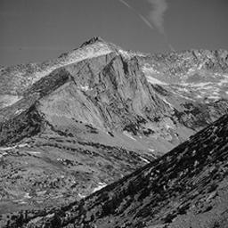 |  |
| Bedroom |  |  |  | 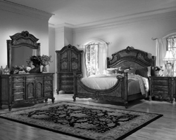 |
| LivingRoom |  |  |  |  |
| Office |  | 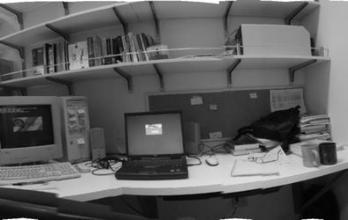 |  | 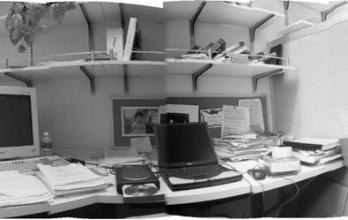 |
| Industrial | 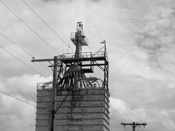 | 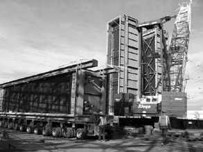 | 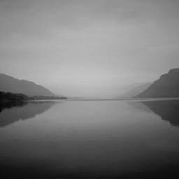 |  |
| Suburb |  |  |  | 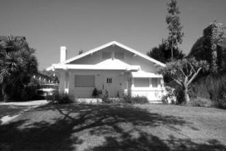 |
| InsideCity |  |  |  |  |
| TallBuilding |  | 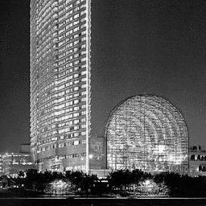 |  |  |
| Street | 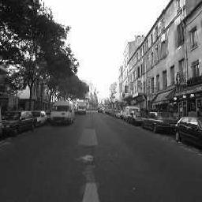 |  |  |  |
| Highway |  |  |  |  |
| OpenCountry |  |  |  |  |
| Coast |  |  |  |  |
| Mountain |  |  |  |  |
| Forest |  |  | 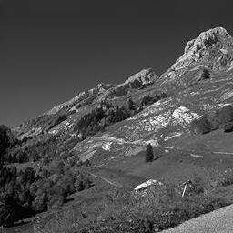 | 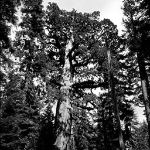 |

